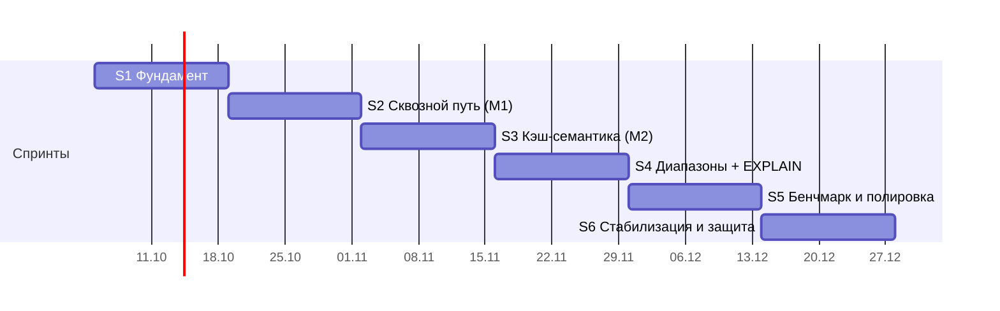

# kpo-sql — план разработки

_Составлен 2026-10-05. Команда: 4 человека, 5–8 ч/нед каждый, срок — до конца семестра (≈ 27 декабря 2026). Код активно пишем с AI-ассистентами (вайбкодинг) — правила в разделе 6._

Контекст и обоснование решений — в [research.md](research.md).

---

## 1. Цель семестра

Рабочий **in-memory SQL-кэш на C++20**, к которому подключается обычный `psql` (и `psycopg2`) по протоколу PostgreSQL, с TTL, лимитом памяти и вытеснением, плюс честный бенчмарк против Redis и PostgreSQL.

**Демо на защите:**

```sql
-- psql -h localhost -p 5433
CREATE TABLE sessions (id BIGINT PRIMARY KEY, user_id INT, token TEXT, created TIMESTAMP)
  WITH (ttl = '30s', max_memory = '64MB');
INSERT INTO sessions VALUES (1, 42, 'abc', now());
SELECT * FROM sessions WHERE user_id = 42 ORDER BY created DESC LIMIT 10;
EXPLAIN SELECT * FROM sessions WHERE id = 1;          -- IndexLookup(pk)
-- через 30 секунд строка исчезает; при превышении 64MB срабатывает вытеснение
```

### Входит в семестр
- Протокол PostgreSQL: Simple Query и Extended Query (prepared statements), ошибки, работа с `psql`, `psycopg2`, `psycopg 3` и `node-postgres`.
- SQL: `CREATE TABLE / DROP TABLE / CREATE INDEX`, `INSERT`, `SELECT` (WHERE, AND/OR, сравнения, BETWEEN, ORDER BY, LIMIT), `UPDATE`, `DELETE`, `EXPLAIN`, `BEGIN/COMMIT` как no-op.
- Типы: `INT`, `BIGINT`, `DOUBLE`, `BOOL`, `TEXT`, `TIMESTAMP`, `NULL`.
- Хэш-индекс по PK, упорядоченный вторичный индекс.
- TTL на таблицу и на строку, `max_memory`, вытеснение SIEVE.
- Бенчмарк, README с результатами, релиз v1.0.0.

### Stretch (если идём с опережением — с AI это реально)
`COUNT/SUM/MIN/MAX` + `GROUP BY`, простой `JOIN` (nested loop / hash join), снапшот на диск.

### Не входит (явно)
Многопоточность, аутентификация, синхронизация с PostgreSQL, сложный оптимизатор. Кандидаты на следующий семестр.

---

## 2. Ёмкость команды

| | Значение |
|---|---|
| Часы | 4 чел × ~6,5 ч × 12 нед ≈ **310 ч** |
| За вычетом созвонов, ревью, отладки интеграции (~25%) | ≈ **230 ч** на код и тесты |
| На спринт (2 недели) | ≈ **40 ч** на команду, ≈ **10 ч** на человека |

**Поправка на вайбкодинг.** AI ускоряет написание кода примерно в 1,5–2 раза (шаблонный код, тесты, протокол, CMake), но почти не ускоряет то, что занимает основную часть времени в системном C++: отладку, интеграцию модулей и ревью. Поэтому план считаем по «человеческим» часам, а освободившееся время идёт в stretch-цели, а не в базовый объём. Если к концу S3 идём с опережением — берём stretch в S5.

Задачи в спринте — по 2–3 штуки на человека, по 3–5 часов. Если задача больше 6 часов — дробим: AI-агенты тоже лучше работают с маленькими, чётко описанными задачами.

---

## 3. Архитектура и владельцы модулей

```
psql / psycopg2
      │  pgwire (TCP)
┌─────▼──────────────┐
│ net/  — Участник A │  event loop (poll), соединения, кодек сообщений, таймеры
└─────┬──────────────┘
      │  std::string query  →  ResultSet / sql::Error
┌─────▼──────────────┐
│ sql/  — Участник B │  лексер, парсер → AST, проверка по каталогу
└─────┬──────────────┘
      │  AST
┌─────▼──────────────┐
│ exec/ — Участник C │  планировщик, операторы, вычисление выражений, EXPLAIN
└─────┬──────────────┘
      │  Table / Index API
┌─────▼──────────────┐
│ storage/ — Уч. D   │  каталог, таблицы, индексы, TTL, учёт памяти, SIEVE
└────────────────────┘
common/ (общее): Value, Type, Row, ResultSet, sql::Error, Config
```

| Участник | Модуль | Доп. ответственность |
|---|---|---|
| **A** | `net/` — сеть и протокол | CI, Docker, релизы |
| **B** | `sql/` — лексер и парсер | Интеграционные тесты (Python + psycopg2) |
| **C** | `exec/` — планировщик и исполнитель | Бенчмарки и профилирование |
| **D** | `storage/` — хранилище и кэш | Учёт памяти, документация архитектуры |

_Впишите имена:_ A — ___, B — ___, C — ___, D — ___.

**Правило ревьюера:** каждый PR ревьюит владелец *соседнего* модуля (A↔B, B↔C, C↔D, D↔A). Так каждый знает минимум два модуля, и уход одного человека не останавливает проект.

### Контракты (фиксируются в первую неделю, дальше меняются только через PR с ревью всех четырёх)
- `common/value.h` — `enum class Type`, `class Value` (variant + NULL), сравнение, вывод в текст для pgwire.
- `common/result.h` — `struct ColumnDesc { name; Type; }`, `struct ResultSet { columns; rows; command_tag; }`.
- `common/error.h` — `struct sql::Error : std::exception { std::string sqlstate; std::string message; }`. Все модули бросают его, `net/` превращает в `ErrorResponse`.
- `sql/ast.h` — узлы `CreateTable`, `Insert`, `Select`, `Update`, `Delete`, `CreateIndex`, `Explain`, выражения.
- `storage/catalog.h`, `storage/table.h` — `create_table`, `get_table`, `insert`, `scan`, `lookup_pk`, `erase`, `memory_used()`.
- Точка входа: `ResultSet Engine::execute(std::string_view sql)` — единственное, что видит `net/`.

Пока соседний модуль не готов, работаем против **заглушек** контрактов — так все четверо стартуют параллельно с первого дня.

---

## 4. Спринты

Спринты по 2 недели, с понедельника по воскресенье. В конце каждого — демо (что работает в `psql`) и релиз через существующий workflow (метка `release:minor`).



### S1 · 5–18 окт · Фундамент
**Цель:** структура репозитория, контракты, тесты в CI; `psql` подключается и получает захардкоженный ответ на `SELECT 1`.

| Кто | Задачи | ≈ ч |
|---|---|---|
| Все | Созвон: согласовать и закоммитить заголовки контрактов (раздел 3), code style | 2 |
| Все | `CLAUDE.md` / `AGENTS.md` в корне репозитория: архитектура, контракты, стиль, правила (раздел 6) — общий контекст для AI-ассистентов всей команды | 1 |
| A | Структура `src/{common,net,sql,exec,storage}` как static-библиотеки в CMake; Catch2 v3 через FetchContent; `ctest` в builder-стадии Dockerfile (CI начнёт гонять тесты сам); сборка с ASan/UBSan; `.clang-format`; переименовать `app` → `kpo-sql` | 4 |
| A | Event loop на `poll()` (работает и на macOS, и на Linux), приём соединений, StartupMessage → AuthenticationOk → ParameterStatus (`server_version`, `client_encoding=UTF8`, `DateStyle`, `standard_conforming_strings`) → ReadyForQuery | 5 |
| B | Лексер: ключевые слова, идентификаторы, числа, строки `'..'` с `''`, операторы, комментарии `--`; тесты | 5 |
| C | `Value`: типы, сравнение, NULL-семантика, приведение, текстовый вывод; `ResultSet`; тесты | 5 |
| D | `Catalog` + `Table`: схема, хранение строк (`std::vector<Row>` + free-list), `insert/scan/erase`; тесты | 5 |

**Готово, когда:** `psql -h localhost -p 5433 -c 'SELECT 1'` возвращает `1`; CI зелёный с тестами и санитайзерами.

### S2 · 19 окт – 1 нояб · Сквозной путь (M1)
**Цель:** настоящие запросы проходят все слои.

| Кто | Задачи | ≈ ч |
|---|---|---|
| A | Query → `Engine::execute` → RowDescription/DataRow/CommandComplete; `ErrorResponse` с SQLSTATE; несколько операторов через `;`; `BEGIN/COMMIT/ROLLBACK` как no-op (нужно для `psycopg2`) | 5 |
| B | Парсер (рекурсивный спуск): `CREATE TABLE`, `DROP TABLE`, `INSERT … VALUES`, `SELECT … FROM … WHERE`; выражения — Pratt-парсер с приоритетами | 6 |
| B | Каркас интеграционных тестов: pytest + psycopg2, отдельный job в CI | 3 |
| C | Планировщик v0: `SeqScan → Filter → Project`; вычисление выражений; исполнитель (Volcano: `open/next/close`) | 6 |
| D | Хэш-индекс по PK (`std::unordered_map<Value, RowId>`), проверка уникальности, `lookup_pk` | 4 |

**Готово, когда:** в `psql` работают `CREATE TABLE / INSERT / SELECT … WHERE`; первые интеграционные тесты в CI.

### S3 · 2–15 нояб · Кэш-семантика (M2)
**Цель:** это уже кэш, а не просто таблицы.

| Кто | Задачи | ≈ ч |
|---|---|---|
| A | Таймеры в event loop (для активного истечения TTL); флаги `--port`, `--max-memory`; корректное завершение по SIGTERM; тест на 100 одновременных клиентов | 5 |
| B | `UPDATE`, `DELETE`; `CREATE TABLE … WITH (ttl = '30s', max_memory = '64MB', eviction = 'sieve')`; `INSERT … WITH TTL '10s'` для строки | 5 |
| C | Исполнители `UPDATE/DELETE`; выбор `IndexLookup(pk)` вместо скана при `WHERE pk = …` | 4 |
| D | TTL: ленивое удаление при чтении + активная выборочная чистка (по таймеру, как в Redis); учёт памяти на таблицу; `max_memory` + вытеснение SIEVE; тесты под нагрузкой | 7 |

**Готово, когда:** строки исчезают по TTL; при превышении лимита старые/холодные строки вытесняются; учёт памяти сходится с реальностью ±10%.

### S4 · 16–29 нояб · Диапазоны и EXPLAIN (M3)
| Кто | Задачи | ≈ ч |
|---|---|---|
| A | Нагрузочный клиент для бенчмарка (C++ или Python); скрипты запуска Redis и PostgreSQL в Docker для сравнения | 5 |
| B | `ORDER BY`, `LIMIT`, `BETWEEN`, `IN (…)`, `IS NULL`; `CREATE INDEX`; `EXPLAIN` | 5 |
| C | Операторы `Sort`, `Limit`, `IndexRangeScan`; выбор индекса по правилам; вывод плана в `EXPLAIN` | 6 |
| D | Упорядоченный вторичный индекс: сначала обёртка над `std::multimap`, затем (stretch) собственное B+-дерево; поддержка индексов при UPDATE/DELETE/TTL/вытеснении | 6 |

**Готово, когда:** `EXPLAIN` показывает использование индекса; диапазонные запросы с `ORDER BY … LIMIT` работают через индекс.

### S5 · 30 нояб – 13 дек · Бенчмарк и полировка (M4)
| Кто | Задачи | ≈ ч |
|---|---|---|
| A | Extended Query (Parse/Bind/Describe/Execute/Sync), кэш планов для prepared statements — заработают psycopg 3 и node-postgres с параметрами | 6 |
| B + C | Stretch при опережении: агрегаты + `GROUP BY`, затем простой `JOIN` | 6–10 |
| B | Фаззинг парсера (libFuzzer) или набор «злых» запросов; понятные сообщения об ошибках с позицией | 4 |
| C | Бенчмарк: точечные чтения/записи против Redis и PostgreSQL; flamegraph (`perf`); исправить топ-2 узких места | 6 |
| D | Профилирование памяти (байт на строку), оптимизация хранения; `docs/architecture.md` | 5 |

**Готово, когда:** в README таблица и график сравнения, разбор, куда уходит время.

### S6 · 14–27 дек · Стабилизация и защита
**Feature freeze** — новых фич нет, только баги, тесты и документация. Буфер на зачётную неделю.

| Кто | Задачи |
|---|---|
| Все | Исправление багов из issues, покрытие тестами критичных путей |
| A | Релиз **v1.0.0** (метка `release:major`), образ в GHCR, инструкция `docker run` |
| B | Пользовательская документация: поддерживаемый SQL, примеры |
| C | Финальные цифры бенчмарка, слайды с результатами |
| D | Архитектурная схема, сценарий демо для защиты; документация по требованиям курса, если нужна |

---

## 5. Процесс

- **Ветки:** GitHub Flow — `feature/<модуль>-<кратко>` → PR в `main`. Прямые пуши в `main` запрещены (branch protection).
- **PR:** не больше ~400 строк; 1 approve от ревьюера по правилу из раздела 3; CI зелёный (сборка, юнит-тесты, ASan/UBSan, интеграционные тесты).
- **Задачи:** GitHub Issues + GitHub Projects (колонки Backlog → Sprint → In progress → Review → Done), метки `net`, `sql`, `exec`, `storage`, `bug`, `stretch`.
- **Встречи:** планирование спринта (понедельник, 30 мин), короткий синк в середине недели (15 мин или в чате), демо и ретро в конце спринта (30 мин).
- **Definition of Done:** код + юнит-тесты, CI зелёный, ревью пройдено, обновлены документы и список поддерживаемого SQL, если затронут синтаксис.
- **Стиль кода:** C++20, `clang-format`, ошибки — исключение `sql::Error` с SQLSTATE; никаких «голых» `new/delete` — RAII и `std::unique_ptr`.

---

## 6. Вайбкодинг: как не утонуть в AI-коде

AI отлично пишет протокольный код, парсер по грамматике, тесты и CMake. Хуже всего у него с тем, что важнее всего в этом проекте: владение памятью, инварианты индексов при удалении/вытеснении и стыки между модулями, написанными четырьмя разными ассистентами.

### Общий контекст для агентов
- **`CLAUDE.md` (или `AGENTS.md`) в корне** — архитектура, ссылки на заголовки контрактов, стиль, команды сборки и тестов, запреты. Поддерживаем его в актуальном виде так же, как код: изменился контракт → обновили файл в том же PR.
- В каждом модуле — короткий `README.md` с инвариантами («RowId стабилен до erase», «индекс обновляется до возврата из insert» и т.п.). Агенту даём читать его перед задачей.
- Issue пишется так, чтобы его можно было отдать агенту как есть: цель, затрагиваемые файлы, критерий готовности, какие тесты должны пройти.

### Правила работы
1. **Тесты — от человека, реализация — может от AI.** Сначала пишем (или хотя бы вычитываем) тесты на поведение, потом просим агента реализовать. Тест, который агент написал под свой же код, доказывает мало.
2. **Контракты в `common/`, `sql/ast.h`, `storage/*.h` агент не меняет сам.** Только через отдельный PR с ревью всех четырёх.
3. **Автор PR объясняет каждую строку.** На ревью ревьюер может спросить «почему здесь так» — «так сгенерировалось» не ответ. Это же подготовка к защите: на ней спросят про ваш код.
4. **Ядро — понимаем досконально.** Event loop, парсер выражений, хэш-индекс, B+-дерево, TTL и SIEVE каждый владелец должен уметь объяснить у доски. Генерировать можно, но после — разобрать и переписать то, что непонятно.
5. **PR ≤ ~400 строк.** Агенты легко выдают 2000 строк за раз — такой PR нельзя нормально проверить. Режем на части.
6. **Санитайзеры и предупреждения — без исключений.** `-Wall -Wextra -Werror`, ASan/UBSan в CI. AI-код на C++ часто компилируется и проходит тесты, но содержит use-after-free или UB; санитайзеры ловят это раньше людей.
7. **Не тащим зависимости, которые предложил агент**, без обсуждения: каждая новая библиотека — решение команды.
8. **Промпты, которые сработали, сохраняем** в `docs/prompts.md` (как сгенерировали кодек pgwire, как просили тесты на парсер) — это ускоряет остальных.

### Где AI даёт максимум
- Кодек сообщений pgwire по документации протокола.
- Лексер и парсер по описанной грамматике, AST-печать для отладки.
- Юнит- и интеграционные тесты, негативные кейсы, фаззинг-обвязка.
- Скрипты бенчмарков, Docker, CI, графики для README.
- Документация и слайды к защите.

---

## 7. Риски

| Риск | Вероятность | Что делаем |
|---|---|---|
| AI-код, который никто в команде не понимает | Высокая | Правила 3–4 раздела 6; ревьюер вправе отклонить PR, если автор не может объяснить |
| Четыре ассистента пишут в четырёх разных стилях и ломают стыки | Высокая | Общий `CLAUDE.md`, замороженные контракты, `clang-format`, интеграционные тесты на каждый PR |
| Тонкие ошибки памяти и UB в сгенерированном C++ | Высокая | `-Werror`, ASan/UBSan в CI, RAII, никаких сырых владеющих указателей |
| «Ад интеграции» — модули не стыкуются | Высокая | Контракты в первую неделю; сквозной путь уже в S2; интеграционные тесты в CI с S2 |
| `psql` / `psycopg2` ведут себя не так, как ожидали | Средняя | Проверять на реальных клиентах с S1; смотреть трафик в Wireshark (фильтр `pgsql`) |
| Кто-то выпадает (сессия, болезнь) | Средняя | Каждый модуль знает ревьюер-сосед; S6 — буфер |
| Раздувание объёма — с AI «легко добавить ещё одну фичу» | Высокая | Список «не входит» выше; stretch берём только после M2 по плану; новые идеи — в Issues с меткой `next-semester` |
| Отставание к S4–S5 | Средняя | Список урезания ниже |

### Что урезаем при отставании (по порядку)
1. Stretch-цели (агрегаты, JOIN, снапшот).
2. Extended Query → остаются `psql` и `psycopg2` на Simple Query.
3. Собственное B+-дерево → оставить `std::multimap`.
4. Фаззинг парсера → ручной набор негативных тестов.
5. Активное истечение TTL → только ленивое.
6. SIEVE → простое FIFO-вытеснение.

Не урезаем никогда: сквозной путь через `psql`, TTL, `max_memory`, тесты в CI, бенчмарк.

---

## 8. Контрольные точки

| Дата | Что показываем |
|---|---|
| 18 окт | `SELECT 1` через `psql`, CI с тестами |
| 1 нояб | CREATE / INSERT / SELECT WHERE через `psql` |
| 15 нояб | TTL, лимит памяти, вытеснение |
| 29 нояб | Индексы, ORDER BY / LIMIT, EXPLAIN |
| 13 дек | Бенчмарк против Redis и PostgreSQL в README |
| 27 дек | Релиз v1.0.0, демо для защиты |
